# Causal Bayes Opt Module Structure

## Actual Package Structure

```
causal_bayes_opt/
├── data_structures/               # Core data structures
│   ├── __init__.py
│   ├── scm.py                     # Immutable SCM representation
│   ├── sample.py                  # Sample dataclass
│   └── buffer.py                  # Mutable experience buffer
│
├── mechanisms/                    # Causal mechanisms
│   ├── __init__.py
│   ├── base.py                    # Base mechanism interface
│   └── linear.py                  # Linear mechanism implementation
│
├── interventions/                 # Intervention handling
│   ├── __init__.py
│   ├── handlers.py                # Intervention handler implementations
│   └── registry.py                # Intervention registry pattern
│
├── environments/                  # SCM environment
│   ├── __init__.py
│   └── sampling.py                # Sampling with/without interventions
│
├── avici_integration/             # AVICI model integration
│   ├── __init__.py
│   ├── core/                      # Core integration utilities
│   │   ├── __init__.py
│   │   ├── conversion.py          # Sample to AVICI format conversion
│   │   ├── data_extraction.py    # Extract data from samples
│   │   ├── standardization.py    # Data standardization
│   │   └── validation.py          # Data validation utilities
│   ├── parent_set/                # Parent set prediction
│   │   ├── __init__.py
│   │   ├── model.py               # ParentSetPredictionModel
│   │   ├── encoding.py            # Parent set encoding/decoding
│   │   ├── enumeration.py         # Enumerate possible parent sets
│   │   ├── inference.py           # Posterior inference
│   │   └── posterior.py           # Posterior representation
│   ├── testing/                   # Testing utilities
│   │   ├── __init__.py
│   │   └── debug_tools.py         # Debug and analysis tools
│   └── utils/                     # Additional utilities
│       ├── __init__.py
│       └── analysis.py            # Data analysis functions
│
├── acquisition/                   # Acquisition model (RL)
│   ├── __init__.py
│   ├── policy.py                  # AcquisitionPolicyNetwork
│   ├── state.py                   # AcquisitionState representation
│   ├── rewards.py                 # Verifiable reward computation
│   ├── trajectory.py              # TrajectoryBuffer for RL
│   └── grpo.py                    # GRPO algorithm implementation ✅
│
├── training/                      # High-performance training infrastructure ✅
│   ├── __init__.py
│   ├── config.py                  # Training configuration system
│   └── surrogate_training.py      # JAX-compiled training (250-3,386x speedup)
│
└── experiments/                   # Experimental utilities
    ├── __init__.py
    └── test_scms.py               # Pre-defined test SCMs
```

## Module Dependencies

```mermaid
graph TD
    %% Data structure dependencies
    SCM[data_structures/scm.py]
    Sample[data_structures/sample.py]
    Buffer[data_structures/buffer.py]
    
    Sample --> Buffer
    SCM --> Sample
    
    %% Mechanism dependencies
    MechBase[mechanisms/base.py]
    MechLinear[mechanisms/linear.py]
    
    MechLinear --> MechBase
    SCM --> MechBase
    
    %% Intervention dependencies
    IntHandlers[interventions/handlers.py]
    IntRegistry[interventions/registry.py]
    
    IntHandlers --> IntRegistry
    IntHandlers --> Sample
    
    %% Environment dependencies
    Sampling[environments/sampling.py]
    
    Sampling --> SCM
    Sampling --> Sample
    Sampling --> IntHandlers
    Sampling --> MechBase
    
    %% AVICI integration dependencies
    Conversion[avici_integration/core/conversion.py]
    DataExtract[avici_integration/core/data_extraction.py]
    Standardize[avici_integration/core/standardization.py]
    Validation[avici_integration/core/validation.py]
    
    Conversion --> DataExtract
    Conversion --> Standardize
    Conversion --> Validation
    DataExtract --> Sample
    
    PSModel[avici_integration/parent_set/model.py]
    PSEncoding[avici_integration/parent_set/encoding.py]
    PSEnum[avici_integration/parent_set/enumeration.py]
    PSInference[avici_integration/parent_set/inference.py]
    PSPosterior[avici_integration/parent_set/posterior.py]
    
    PSModel --> PSEncoding
    PSInference --> PSModel
    PSInference --> PSEnum
    PSInference --> PSPosterior
    PSPosterior --> PSEncoding
    
    %% Acquisition dependencies
    AcqPolicy[acquisition/policy.py]
    AcqState[acquisition/state.py]
    AcqRewards[acquisition/rewards.py]
    AcqTraj[acquisition/trajectory.py]
    AcqGRPO[acquisition/grpo.py]
    
    AcqPolicy --> AcqState
    AcqRewards --> AcqState
    AcqRewards --> PSPosterior
    AcqTraj --> AcqState
    AcqTraj --> Sample
    AcqGRPO --> AcqPolicy
    AcqGRPO --> AcqState
    AcqGRPO --> AcqRewards
    AcqGRPO --> AcqTraj
    
    %% Experiments
    TestSCMs[experiments/test_scms.py]
    
    TestSCMs --> SCM
    TestSCMs --> MechLinear
```



## Key Design Principles per Module

### Data Structures
- **Immutable SCM and Sample**: Using `pyrsistent` for thread-safety and predictability
- **Mutable ExperienceBuffer**: Performance-optimized with append-only operations
- **Pure functions** for all data transformations and queries

### Mechanisms
- **Base class pattern** for extensibility
- **Pure sampling functions** with explicit random key threading
- **Composable** linear mechanisms with noise

### Interventions
- **Registry pattern** for extensible intervention types
- **Handler abstraction** for different intervention strategies
- **Immutable intervention representations**

### Environments
- **Pure sampling functions** respecting causal order
- **Intervention-aware** sampling with topological sorting
- **Batch processing** support for efficiency

### AVICI Integration
- **Clean data bridge** between internal and AVICI formats
- **Modular parent set handling** with enumeration and encoding
- **JAX-based neural networks** following AVICI patterns
- **Target-aware conditioning** throughout

### Acquisition
- **State-based decision making** with rich context
- **Verifiable rewards** without human feedback
- **Trajectory buffer** for GRPO training
- **Pure GRPO implementation** following DeepSeek literature ✅
- **Group-based advantages** with no value network
- **Literature-compliant** KL divergence and normalization
- **Pure reward computation** functions

### Training ✅
- **JAX-compiled training steps** with 250-3,386x performance improvements
- **Static argument handling** for JAX compatibility (hashability solutions)
- **Graceful fallback mechanisms** when compilation fails
- **JAX-compatible loss functions** (kl_divergence_loss_jax, uncertainty_weighted_loss_jax)
- **Adaptive training infrastructure** with automatic optimization detection
- **Performance monitoring** and benchmarking capabilities
- **Integration with behavioral cloning** pipeline

### Experiments
- **Pre-defined test cases** for consistent evaluation
- **Variety of SCM structures** (chains, forks, colliders)

## Interface Contracts

Each module exposes a clean interface through its `__init__.py`:

- **data_structures**: `create_scm()`, `create_sample()`, `ExperienceBuffer`
- **mechanisms**: `Mechanism` base class, `create_linear_mechanism()`
- **interventions**: `@register_intervention_handler`, `apply_intervention()`
- **environments**: `sample_with_intervention()`, `generate_mixed_dataset()`
- **avici_integration**: `samples_to_avici_data()`, `ParentSetPredictionModel`
- **acquisition**: `AcquisitionPolicyNetwork`, `compute_rewards()`, `AcquisitionState`
- **training**: `create_jax_surrogate_train_step()`, `TrainingBatchJAX`, JAX-compiled training infrastructure ✅
- **experiments**: Pre-configured test SCMs for evaluation