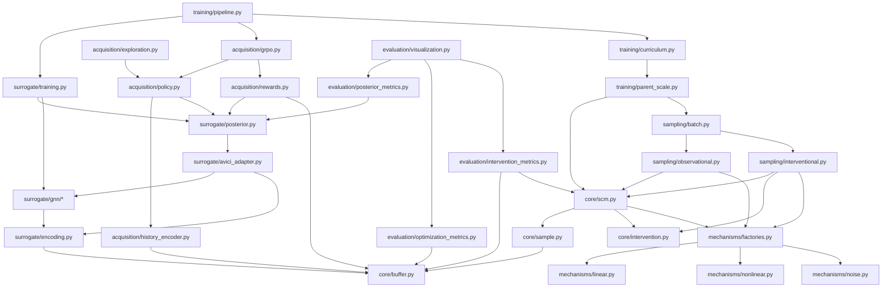

# ACBO Module Structure Diagram

## Core Package Structure

```
acbo/
├── core/                          # Core data structures and interfaces
│   ├── __init__.py
│   ├── scm.py                     # SCM representation and graph utilities
│   ├── sample.py                  # Sample representation and utilities
│   ├── intervention.py            # Intervention types and registry
│   └── buffer.py                  # Experience buffer implementation
│
├── mechanisms/                    # Mechanism framework
│   ├── __init__.py
│   ├── factories.py              # Mechanism factory functions
│   ├── linear.py                 # Linear mechanisms
│   ├── nonlinear.py              # Nonlinear mechanisms
│   └── noise.py                  # Noise generation utilities
│
├── sampling/                      # Sampling functionality
│   ├── __init__.py
│   ├── observational.py          # Observational data sampling
│   ├── interventional.py         # Interventional data sampling
│   └── batch.py                  # Batch sampling utilities
│
├── surrogate/                     # Surrogate model (AVICI adaptation)
│   ├── __init__.py
│   ├── gnn/                      # Graph neural network architectures
│   │   ├── __init__.py
│   │   ├── gat.py               # Graph Attention Networks
│   │   ├── transformer.py       # Graph Transformers
│   │   └── gated_gcn.py         # GatedGCN implementation
│   ├── avici_adapter.py          # AVICI integration layer
│   ├── posterior.py              # Posterior representation and utilities
│   ├── encoding.py               # Data encoding for neural networks
│   └── training.py               # Multi-loss training framework
│
├── acquisition/                   # Acquisition model (RL with GRPO)
│   ├── __init__.py
│   ├── history_encoder.py        # Intervention history encoding
│   ├── policy.py                 # Policy network implementation
│   ├── rewards.py                # Verifiable reward system
│   ├── grpo.py                   # GRPO algorithm implementation
│   └── exploration.py            # Exploration strategies
│
├── training/                      # Training infrastructure
│   ├── __init__.py
│   ├── curriculum.py             # Curriculum learning implementation
│   ├── pipeline.py               # Multi-stage training pipeline
│   ├── parent_scale.py           # PARENT_SCALE integration
│   └── utils.py                  # Training utilities
│
├── evaluation/                    # Evaluation and metrics
│   ├── __init__.py
│   ├── posterior_metrics.py      # Posterior accuracy evaluation
│   ├── optimization_metrics.py   # Optimization performance metrics
│   ├── intervention_metrics.py   # Intervention quality assessment
│   └── visualization.py          # Results visualization
│
└── utils/                         # General utilities
    ├── __init__.py
    ├── validation.py             # Input validation functions
    ├── logging.py                # Logging and debugging utilities
    └── config.py                 # Configuration management
```

## Module Dependencies



## Key Design Principles per Module

### Core Modules
- **Immutable data structures** for SCM, Sample, Intervention
- **Mutable performance-optimized** buffer with append-only operations
- **Pure functions** for all data transformations

### Mechanisms
- **Factory pattern** for mechanism creation
- **Composable building blocks** for complex mechanisms
- **Pure functions** with explicit noise handling

### Sampling
- **Topological ordering** for causal consistency
- **Batch processing** capabilities
- **Intervention-aware** sampling logic

### Surrogate Model
- **Standard PyTorch** mutable parameters for neural networks
- **Immutable configurations** and hyperparameters
- **Pure functions** for data encoding/decoding

### Acquisition Model
- **Standard RL** mutable training state
- **Immutable policy configurations**
- **Pure functions** for reward computation

### Training
- **Explicit state management** for training loops
- **Immutable curriculum specifications**
- **Efficient checkpointing** system

## Interface Contracts

Each module exposes a clean interface through its `__init__.py`:

- **Core**: SCM, Sample, Intervention, Buffer classes and their factories
- **Mechanisms**: Mechanism factories and noise generators
- **Sampling**: Sampling functions (observational, interventional, batch)
- **Surrogate**: encode_data, decode_posterior, training utilities
- **Acquisition**: Policy networks, GRPO algorithm, reward functions
- **Training**: Training pipelines and curriculum learning
- **Evaluation**: Metrics computation and visualization tools